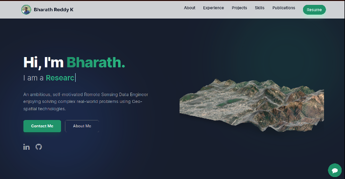

# Personal Portfolio ⚡️
> A modern, interactive, and responsive portfolio template for Data Scientists & Engineers!

> https://bharathk113.github.io

### Website Preview

  <kbd>
    
  </kbd>

:star: Star me on GitHub — it helps!

## Features 📋
⚡️ **Modern UI:** Built with **Tailwind CSS** for a clean, glassmorphism-inspired look.\
⚡️ **Interactive 3D:** Integrated **Google Model Viewer** for AR/3D content.\
⚡️ **AI Chatbot:** Context-aware AI assistant powered by Ollama & Ngrok.\
⚡️ **Animations:** Smooth scroll animations using **AOS** and typing effects with `Typed.js`.\
⚡️ **Fully Responsive:** Optimized for Mobile, Tablet, and Desktop.

## Installation & Deployment 📦
- Clone the repository and modify the content of <b>index.html</b> according to your requirement.
- Add your project images and logos to the `assets/img/` directory.
- Update `context.js` with your personal information for the AI Chatbot.
- I highly recommend using [Github Pages](https://pages.github.com/) to deploy the website.
- To deploy your website, create a GitHub repository named `<your-github-username>.github.io`.
- Push the code to the `master` (or `main`) branch of this repository.

## Sections 📚
✔️ Hero Section with 3D Model\
✔️ About Me\
✔️ Experience (Timeline view)\
✔️ Major Professional Projects\
✔️ Hobby Projects\
✔️ Skills (with Logo support)\
✔️ Education\
✔️ Publications (Auto-fetched)\
✔️ Achievements\
✔️ Contact Info\
✔️ AI Assistant

To view a live example, **[click here](https://bharathk113.github.io/)**

## Tools Used 🛠️
* [<b>GitHub Pages</b>](https://pages.github.com/) - Hosting.
* [<b>Tailwind CSS</b>](https://tailwindcss.com/) - Utility-first CSS framework for styling.
* [<b>Google Model Viewer</b>](https://modelviewer.dev/) - For displaying 3D GLTF models.
* [<b>AOS</b>](https://michalsnik.github.io/aos/) - Animate On Scroll library.
* [<b>Typed.js</b>](https://mattboldt.com/demos/typed-js/) - Typing animation effect.
* [<b>FontAwesome</b>](https://fontawesome.com/) - Icons.

## Contributing 💡
#### Step 1

- **Option 1**
    - 🍴 Fork this repo!

- **Option 2**
    - 👯 Clone this repo to your local machine.

#### Step 2

- **Build your code** 🔨🔨🔨

#### Step 3

- 🔃 Create a new pull request.

## License 📄
This project is licensed under the MIT License - see the [LICENSE.md](./LICENSE) file for details.